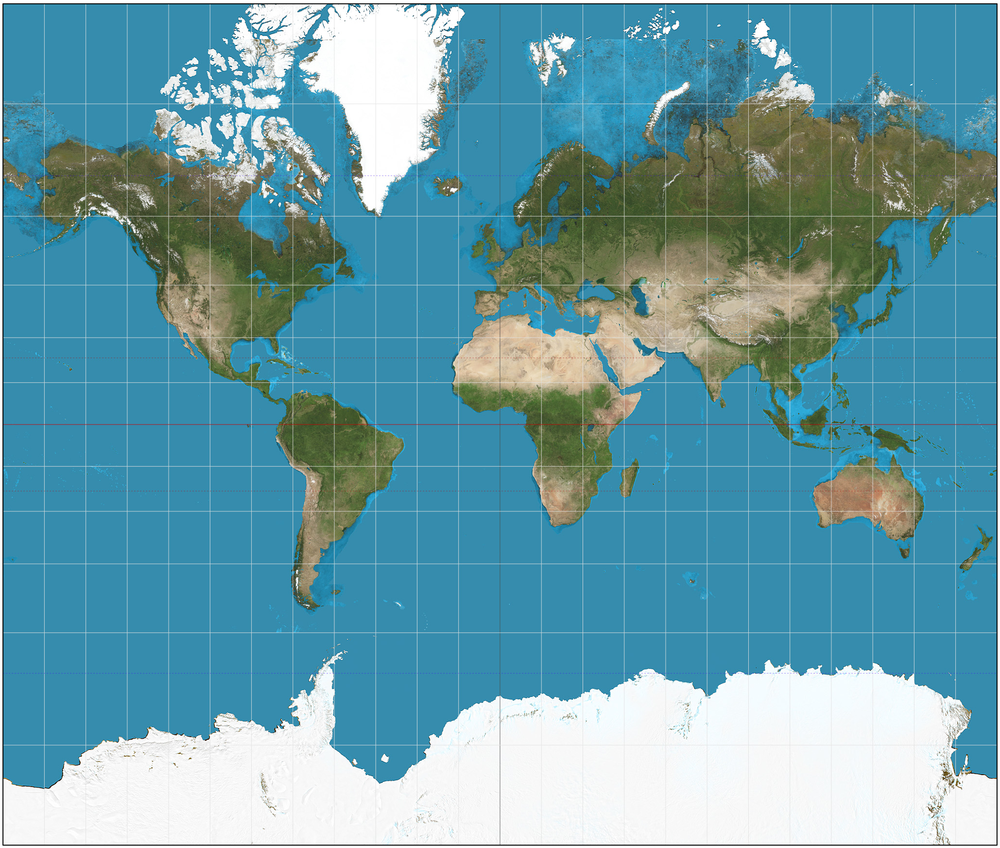
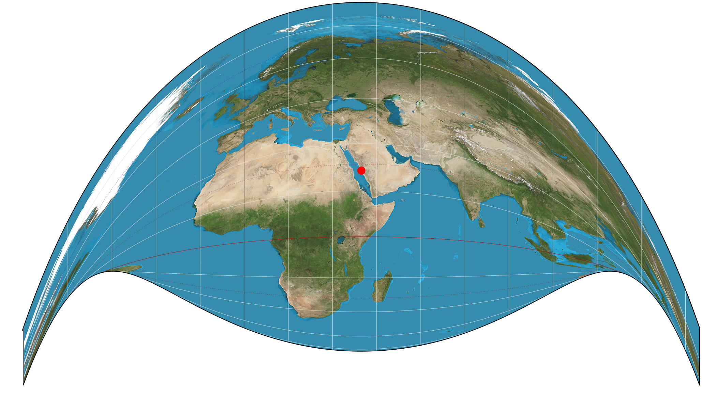

## Geospatial analytics in Python

November 2017

<small>Christopher Prince</small>

---

### Topics

<section style="text-align: left;">

What we'll cover:
* Spatial data formats
* Feature creation
* Map projections
* Spatial operations and manipuation
* Plotting
* Statistical methods

What we won't cover:
* Interfaces to GIS packages (like QGIS or ArcGIS)

---

### What is 'geospatial' anyway?

'Geospatial' refers to analytic techniques that are applied to datasets with geometric 

---

### Shapely

Shapely is a python library for geometric operations using the GEOS library.
Shapely can perform:
geometry validation
geometry creation (e.g. collections)
geometry operations
  
- -
### Shapely geometric operations

<small style="text-align: left;">source: http://kjordahl.github.io/SciPy-Tutorial-2015/</small>

- -
### Shapely geometric operations

<small style="text-align: left;">source: http://kjordahl.github.io/SciPy-Tutorial-2015/</small>

- -
### Shapely geometric operations

<small style="text-align: left;">source: http://kjordahl.github.io/SciPy-Tutorial-2015/</small>
  
- -
### Shapely geometric operations

<small style="text-align: left;">source: http://kjordahl.github.io/SciPy-Tutorial-2015/</small>
  
- -
### Shapely geometric operations
<pre>
>>> line = LineString([(0, 0), (1, 1), (0, 2), (2, 2), (3, 1), (1, 0)])
>>> dilated = line.buffer(0.5)
>>> eroded = dilated.buffer(-0.3)
</pre>

<small style="text-align: left;">source: http://kjordahl.github.io/SciPy-Tutorial-2015/</small>
 
- -
### Binary predicates 
<code>object.almost_equals(other[, decimal=6])</code>
<code>object.contains(other)</code>
<code>object.crosses(other)</code>
<code>object.disjoint(other)</code>
<code>object.equals(other)</code>
<code>object.intersects(other)</code>
<code>object.touches(other)</code>
<code>object.within(other)</code>
<footer class="source"><a href=http://toblerity.github.io/shapely/manual.html#binary-predicates>details</a></footer></article>
 

---

### Geographic projection

<iframe width="784" height="443" src="https://www.youtube.com/embed/vVX-PrBRtTY?rel=0&amp;controls=0&amp;showinfo=0&amp;start=46" frameborder="0" allowfullscreen></iframe><!-- .element: class="fragment" data-fragment-index="1" -->
<small>https://youtu.be/vVX-PrBRtTY?t=46s</small><!-- .element: class="fragment" data-fragment-index="1" -->

- -

<small>Mercator projection (1569)</small>
- -

<small>Craig retroazimuthal projection (1909)</small>
